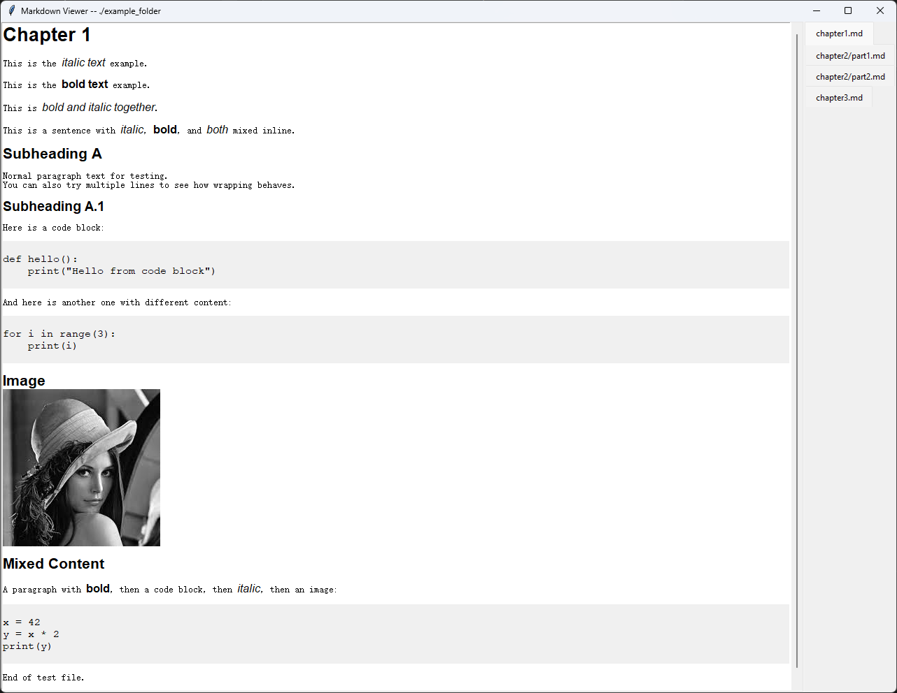

# 📘 **Markdown Reader (Tkinter‑based)**

A lightweight, cross‑platform Markdown viewer built entirely with **standard Python libraries** — no external dependencies required.  
It recursively loads all `*.md` files from a given folder and displays each file in its own tab.

This tool is ideal for quickly browsing notes, documentation, or research logs without installing heavy editors.

---

## ✨ Features

- **Pure Python + Tkinter** — no external packages needed  
- **Recursive folder scanning** for `*.md` files  
- **One tab per file**, with paths shown relative to the chosen folder  
- **Markdown rendering**, including:
  - `#`, `##`, `###` headings  
  - *italic*, **bold**, and ***bold+italic***  
  - Inline code `` `like this` ``  
  - Fenced code blocks  
- **Resizable window**, scrollable content  
- **Cross‑platform** (Linux, macOS, Windows)  
- **Command‑line folder selection**  

> Image support is planned but currently disabled.

---

## 🚀 Usage

### Open a specific folder

```
python ./main.py ./example_folder
```

Then it will use the input as base for images, and shows like



---

## 📂 Folder Structure

All markdown files under the chosen folder are discovered recursively:

```
notes/
├── intro.md
├── chapter1/
│   └── overview.md
└── appendix/
    └── references.md
```

Tabs will appear as:

```
intro.md
chapter1/overview.md
appendix/references.md
```

Paths are normalized to use forward slashes for consistency across platforms.

---

## 📝 Supported Markdown Syntax

### Headings

```
# Heading 1
## Heading 2
### Heading 3
```

### Inline formatting

```
*italic*
**bold**
***bold and italic***
`inline code`
```

### Code blocks

<pre>
```
def hello():
    print("Hello")
```
</pre>

### Images (planned)

```

```

Image parsing is implemented but disabled until the feature is finalized.

---

## 🧩 Implementation Notes

- The UI uses a `ttk.Notebook` with tabs on the **right** for better alignment.
- Each tab contains a `Text` widget with a vertical scrollbar.
- Markdown is rendered using a small custom tokenizer (no external parser).
- Inline formatting is handled via Tkinter text tags.
- The code is intentionally simple and hackable — ideal for extending.

---

## 🛠 Requirements

- Python 3.8+
- Tkinter (included with most Python installations)

No external libraries required.

---

## 📌 Roadmap

- [ ] Image rendering (PNG/GIF first, optional JPEG via Pillow)  
- [ ] Tree‑view sidebar instead of Notebook tabs  
- [ ] Dark mode  
- [ ] Search inside markdown  
- [ ] Auto‑reload on file changes  
- [ ] Split‑view comparison mode  
